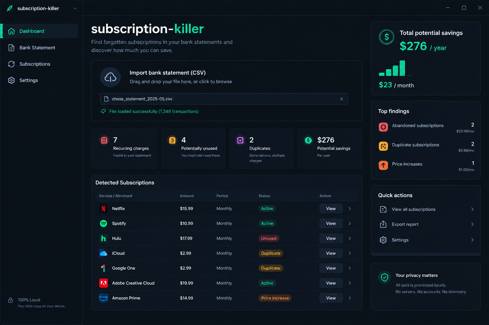

# 🔪 Subscription-Killer

> Find recurring subscriptions in your bank statements and estimate how much money you could save.



<p align="center">
  <a href="https://github.com/dmitry-king1999t3/subscription-killer/releases/latest">
    
  </a>
</p>

<p align="center">
  
  
  
  
  
</p>

---

## 💡 What is subscription-killer?

**subscription-killer** is an open-source local tool for finding recurring payments in bank statements.

Instead of manually searching through hundreds of transactions, the application analyzes your CSV statement and looks for payments that appear to repeat regularly.

It can help identify:

- 🔄 Recurring monthly payments
- 💳 Repeated charges from the same merchant
- 💰 Potential subscription expenses
- 📊 Estimated monthly spending
- 📅 Estimated yearly spending

Everything is designed to run **locally on your computer**.

---

## 📥 Installation

### Windows

The easiest way to use **subscription-killer** is to download the latest release.

<p align="center">
  <a href="https://github.com/dmitry-king1999t3/subscription-killer/releases/latest">
    
  </a>
</p>

### Installation steps

1. Open the latest GitHub Release.
2. Download `installer.zip` from the **Assets** section.
3. Extract the ZIP archive.
4. Open `subscription-killer.exe`.
5. Follow the installation instructions.
6. Launch the application.

> **Note:** Only download releases from the official GitHub repository.

---

## 🧑‍💻 Run From Source

Want to inspect, modify or develop the project?

### Requirements

- Python 3.10+
- Git
- No external Python packages required

The project currently uses only the Python standard library.

### Clone the repository

```bash
git clone https://github.com/dmitry-king1999t3/subscription-killer.git
```

### Enter the project directory

```bash
cd subscription-killer
```

### Run the scanner

```bash
python -m src.subkiller.cli scan statement.csv
```

Example:

```bash
python -m src.subkiller.cli scan your_statement.csv
```

---

## ⚡ Quick Example

Example CSV file:

```csv
date,merchant,amount
2026-09-01,Hulu,17.99
2026-09-05,Spotify,11.99
2026-10-01,Hulu,17.99
2026-10-05,Spotify,11.99
```

Run:

```bash
python -m src.subkiller.cli scan statement.csv
```

Example output:

```text
💸 Found 2 recurring charges

🔄 Hulu                      $17.99/mo
🔄 Spotify                   $11.99/mo

💰 Potential monthly savings: $29.98
💰 Potential yearly savings:  $359.76
```

---

## 🎯 Why?

Subscriptions are easy to forget.

A small payment every month might not seem important, but several recurring payments can add up over an entire year.

For example:

```text
Streaming service       $17.99/mo
Music service           $11.99/mo
Cloud storage            $9.99/mo
VPN                      $8.00/mo
─────────────────────────────────
Total                   $47.97/mo

Estimated yearly cost:
$575.64/year
```

**subscription-killer helps you find these recurring expenses faster.**

---

## ⚙️ How It Works

The current version uses a simple transaction analysis pipeline:

```text
Bank Statement
      │
      ▼
     CSV
      │
      ▼
┌──────────────────────┐
│   Load Transactions  │
└──────────────────────┘
      │
      ▼
┌──────────────────────┐
│ Group by Merchant    │
│ + Amount             │
└──────────────────────┘
      │
      ▼
┌──────────────────────┐
│ Analyze Time Intervals│
└──────────────────────┘
      │
      ▼
Recurring Payments
      │
      ▼
Potential Savings
```

### 1. Import

The application reads a CSV bank statement.

### 2. Parse

Transactions are extracted using:

- Date
- Merchant / Description
- Amount

### 3. Group

Transactions are grouped by merchant and payment amount.

### 4. Analyze

The application checks whether payments occur at approximately monthly intervals.

The current detection range is approximately:

```text
20–40 days
```

### 5. Calculate

The application estimates monthly and yearly recurring expenses.

---

## ✨ Features

### 🔄 Recurring Payment Detection

Detects repeated transactions from the same merchant with the same amount.

### 💰 Savings Estimation

Calculates estimated recurring spending:

```text
Monthly recurring expenses
        ↓
Yearly recurring expenses
        ↓
Potential savings estimate
```

### 📄 CSV Support

The scanner currently supports CSV files containing transaction information.

Required fields:

```text
date
merchant / description
amount
```

### 🔒 Local-First

Your bank statement is processed locally.

There is no requirement for:

- ❌ Cloud accounts
- ❌ Bank credentials
- ❌ Remote database
- ❌ Telemetry
- ❌ Uploading your CSV to a server

### 🧩 Open Source

The source code is publicly available and can be inspected, modified and extended.

---

## 📋 Input Format

The scanner expects a CSV file with transaction information.

Example:

```csv
date,merchant,amount
2026-09-01,Netflix,15.99
2026-09-03,Spotify,11.99
2026-10-01,Netflix,15.99
2026-10-03,Spotify,11.99
```

The application accepts:

```text
date
merchant
amount
```

or:

```text
date
description
amount
```

---

## 🏦 Bank Compatibility

The project works with **standardized CSV transaction data**.

Because banks use different CSV formats, compatibility depends on the structure of the exported statement.

If your bank uses different column names or formatting, the parser may need additional support.

Future versions may include dedicated importers for more bank formats.

---

## 🔐 Privacy & Security

Financial information is sensitive.

**subscription-killer is designed to process your transaction data locally.**

Your CSV does not need to be uploaded to a remote service.

### No:

- ❌ Cloud processing
- ❌ Bank login
- ❌ User account
- ❌ Advertising trackers
- ❌ Telemetry
- ❌ Remote financial database

### Yes:

- ✅ Local processing
- ✅ Open-source code
- ✅ User-controlled data
- ✅ Offline-friendly workflow

> **Security note:** Be careful when sharing bank statements. Remove sensitive personal information before sharing transaction files publicly.

---

## 📂 Project Structure

```text
subscription-killer/
│
├── assets/
│   └── dashboard.png
│
├── src/
│   └── subkiller/
│       ├── __init__.py
│       ├── cli.py
│       └── scanner.py
│
├── README.md
├── LICENSE
├── .gitignore
└── requirements.txt
```

### `scanner.py`

Contains the main transaction processing logic:

- CSV loading
- Transaction parsing
- Recurring payment detection
- Savings calculation

### `cli.py`

Provides the command-line interface.

### `__init__.py`

Contains the project version.

---

## 🛠️ Development

The project is open source and can be modified or extended.

The main scanner logic is located in:

```text
src/subkiller/scanner.py
```

The command-line interface is located in:

```text
src/subkiller/cli.py
```

Run the scanner with:

```bash
python -m src.subkiller.cli scan statement.csv
```

---

## 🚀 Roadmap

Possible future improvements:

- [ ] Better merchant normalization
- [ ] Weekly subscription detection
- [ ] Yearly subscription detection
- [ ] Subscription price change detection
- [ ] Duplicate subscription detection
- [ ] Smarter recurring payment detection
- [ ] Automatic merchant categorization
- [ ] More bank CSV formats
- [ ] Exportable reports
- [ ] Graphs and statistics
- [ ] Improved Windows GUI
- [ ] Automatic subscription history
- [ ] More advanced savings analytics

---

## 🤝 Contributing

Contributions are welcome.

If you want to improve the project:

1. Fork the repository.
2. Create a new branch.
3. Make your changes.
4. Test the changes.
5. Open a Pull Request.

Bug reports and feature suggestions are also welcome through GitHub Issues.

---

## 📦 Latest Release

**Current version: `v1.0.0`**

Download the latest release:

<p align="center">
  <a href="https://github.com/dmitry-king1999t3/subscription-killer/releases/latest">
    
  </a>
</p>

---

## 📄 License

This project is licensed under the **MIT License**.

See [LICENSE](LICENSE) for the full license text.

---

## 👤 Author

Created by **[dmitry-king1999t3](https://github.com/dmitry-king1999t3)**.

If you find the project useful, consider giving it a ⭐ on GitHub.

---

<p align="center">
  <b>Find recurring payments. Understand your spending. Keep more of your money. 💰</b>
</p>
